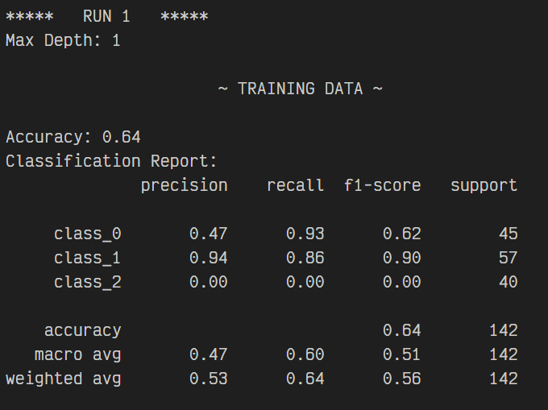
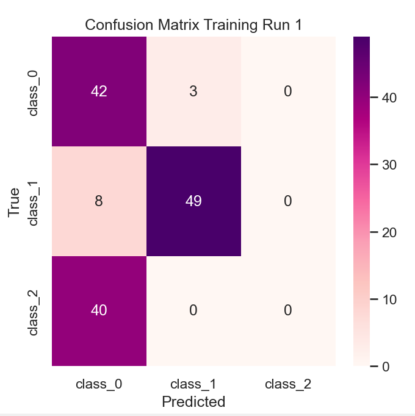
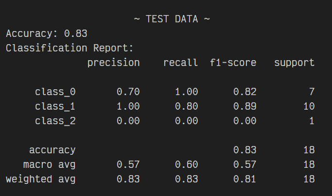

# Uso de framework o biblioteca de aprendizaje máquina para la implementación de una solución. 

- Programa uno de los algoritmos vistos en el módulo (o que tu profesor de módulo autorice) haciendo uso de una biblioteca o framework de aprendizaje máquina. Lo que se busca es que demuestres tu conocimiento sobre el framework y como configurar el algoritmo. 
- Prueba tu implementación con un set de datos y realiza algunas predicciones. Las predicciones las puedes correr en consola o las puedes implementar con una interfaz gráfica apoyándote en los visto en otros módulos.

## Clasificación de Vinos con Árboles de Decisión

Este proyecto utiliza árboles de decisión para clasificar vinos. Se utiliza la biblioteca scikit-learn para cargar el conjunto de datos de vinos, dividirlo en conjuntos de entrenamiento y prueba, entrenar un clasificador de árbol de decisión y evaluar su rendimiento. También incluye un ejemplo de cómo hacer predicciones con el modelo entrenado.

### Requisitos

Descargar el archivo `decision_tree_framework.py` y guardarlo en una carpeta independiente.

Para ejecutar este archivo, necesitas tener Python 3.x instalado en tu computadora. Además, debes instalar las bibliotecas necesarias que se encuentran en el archivo `requirements.txt` que también deberás descargar y guardar en la misma carpeta que el código de Python. Para instalar las bibliotecas usa pip:

    pip install -r requirements.txt

Para correr el codigo debe correr el siguiente comando:

    python decision_tree_framework.py

### Wine Dataset

La razón por la que elegí este conjunto de datos es por las siguientes razones:

- **CLASES DE VINOS**: El conjunto de datos de vinos contiene tres clases de vinos diferentes **(class_0, class_1, class_2)**, lo que lo convierte en un buen escenario para la clasificación de datos

- **CANTIDAD DE ATRIBUTOS**: Los atributos asociados a cada muestra de vino, como el contenido de alcohol, la cantidad de ácido málico presente, la cantidad de ceniza en los vinos, el nivel de alcalinidad de la ceniza, la concentración de magnesio en los vinos, la cantidad total de fenoles, la cantidad de flavonoides presentes, la cantidad de fenoles que no son flavonoides, la concentración de proantocianidinas, la intensidad del color de los vinos, el tono de color, una medida relacionada con la absorbancia de vinos diluidos y la cantidad de prolina en los vinos. Estos datos son relevantes para la clasificación de vinos.

Decidí ocupar árboles de decisión para resolver este problema ya que tienen algunas ventajas como el ajuste de hiperparámetros que en este caso sería la profundidad máxima del árbol.

### Hiperparámetro

- **Profundidad Máxima del Árbol ('max_depth')**: se limita la profundidad máxima del árbol para evitar el overfitting y controlar la complejidad del modelo. En este caso se ocupan 3 valores de max_depth (1, 2 y 3) y se entrena y evalúa con cada uno de ellas.

### Evaluación del Modelo

Para la evaluación del modelo se incluyen metricas como accuracy, el informe de clasificación (precision, recall, F1 score) y la matríz de confusión. Además para ver el rendimiento del modelo se usan datos de validación, de esta forma también podemos evitar el overfitting.

### Resultados

El código mostrará la siguiente información para cada ejecución:

- Número de ejecución del modelo
- Profundidad máxima del árbol de decisión.
- Precisión del modelo en los conjuntos de datos de entrenamiento y prueba.
- Informe de clasificación que incluye precisión, recall, puntuación F1 y soporte para cada clase.
- Mapa de calor de la matriz de confusión tanto para los conjuntos de datos de entrenamiento como para los de prueba.

Finalmente, realizará una predicción de ejemplo para una nueva entrada de vino utilizando el modelo entrenado.

